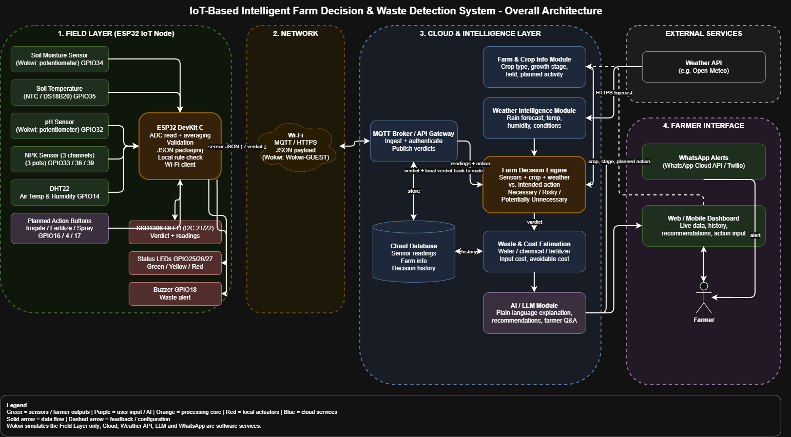
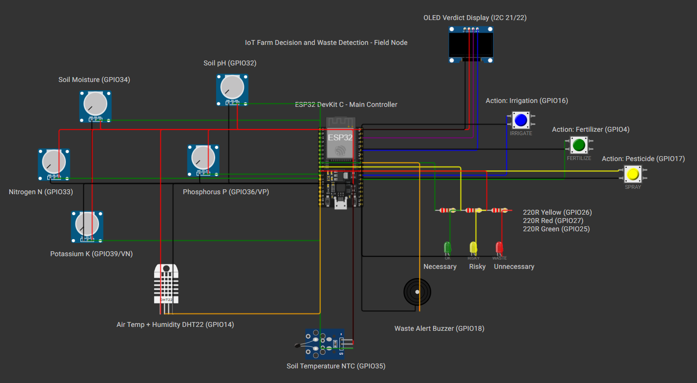

# FarmGuard: IoT-Based Intelligent Farm Decision & Waste Detection System

An ESP32 field node that does more than monitor. It checks whether a farmer's planned action (irrigate, fertilize or spray) is actually needed, classifies it as **Necessary**, **Risky** or **Potentially Unnecessary**, and estimates the avoidable waste.

**Competition:** IoTrix 2.0 Semi-Final, Track A (Embedded IoT System)
**Team:** T4D, South Eastern University of Sri Lanka

> **Status:** the field node is simulated in Wokwi. The cloud backend, weather API, LLM explanation, WhatsApp alerts, dashboard and the real hardware build are planned (see the roadmap and [`cloud/`](cloud/README.md)).

## The problem

Smart farming systems show sensor values, but they do not tell the farmer whether a planned action is needed. Farmers often irrigate or fertilize out of habit, which can waste water, fertilizer and money, and can harm the crop. FarmGuard checks the planned action against sensor readings (and later the weather forecast and crop stage) before the farmer acts.

## How it works

The farmer presses a button for the planned action. The system gives a verdict:

| Verdict                 | Indicator          | Meaning                                                                 |
| ----------------------- | ------------------ | ----------------------------------------------------------------------- |
| Necessary               | Green LED          | Field conditions support the action                                     |
| Risky                   | Yellow LED         | The action may be badly timed, for example fertilizer before heavy rain |
| Potentially Unnecessary | Red LED and buzzer | Conditions suggest the action may not be needed now                     |

The decision is made by transparent rules. An LLM (planned) only explains the result and never decides.

## Architecture



```
Sensors -> ESP32 -> Wi-Fi (MQTT / HTTPS) -> Cloud backend (weather API + crop/cost DB)
        -> Decision engine -> Waste / cost estimate -> LLM explanation
        -> WhatsApp / Dashboard -> Farmer
```

The editable diagram is in `docs/architecture.drawio` (open it at https://app.diagrams.net with File > Open from > Device). If the node loses its network connection, it still shows a local verdict on its OLED, LEDs and buzzer.

## Field node circuit (Wokwi)



Pin reference: [`docs/pin-mapping.md`](docs/pin-mapping.md)

| Real sensor                        | Wokwi substitute       |
| ---------------------------------- | ---------------------- |
| Capacitive soil moisture           | Potentiometer          |
| Analog pH probe                    | Potentiometer          |
| RS485 NPK probe (N, P, K)          | 3 potentiometers       |
| DS18B20 / NTC soil temperature     | NTC temperature sensor |
| DHT22 air temperature and humidity | DHT22                  |

Other parts: SSD1306 OLED (I2C), 3 action buttons, 3 status LEDs and a buzzer.

## Repository layout

```
FarmGuard/
├── README.md
├── .gitignore
├── wokwi/                  Wokwi project (field node)
│   ├── sketch.ino          ESP32 firmware
│   ├── diagram.json        Circuit
│   └── libraries.txt       Arduino libraries
├── docs/
│   ├── FarmGuard_Project_Proposal.docx
│   ├── FarmGuard_One_Page_Technical_Progress_Report.docx
│   ├── architecture.drawio System architecture diagram
│   ├── pin-mapping.md      Pin and wiring reference
│   └── images/             Images used in this README
└── cloud/
    └── README.md           Planned backend (not implemented yet)
```

## Run the simulation

1. Create a new ESP32 project at https://wokwi.com.
2. Copy `wokwi/sketch.ino`, `wokwi/diagram.json` and `wokwi/libraries.txt` into the matching tabs.
3. Press Play.

Serial monitor commands (115200 baud): `rain <mm>`, `crop <1-3>`, `act <0-3>`, `help`.

## Validation plan

A simulation alone is not enough proof, so each scenario is tested in Wokwi and then on a real ESP32 with real sensors, and the results are compared against reference measurements. The scenario test matrix and the real-world validation plan are in Section 14 of the [project proposal](docs/FarmGuard_Project_Proposal.docx). No measured results are reported yet; they will be added here once the tests are done.

## Documents

- [One-page technical progress report](T4D_Technical_Progress_Report.pdf)

## Roadmap

- [x] Field node firmware and Wokwi circuit
- [ ] Cloud API (decision engine, database)
- [ ] Weather API integration
- [ ] LLM explanation module
- [ ] WhatsApp alerts and web dashboard
- [ ] Real hardware build and real-world validation
